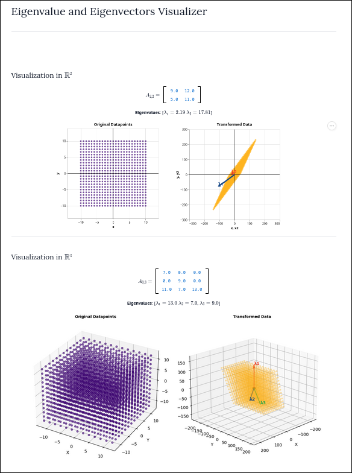

# Eigen-Viz

**Eigen-Viz** is an interactive visualization tool for exploring eigenvalues and eigenvectors. Designed for students, educators, and enthusiasts, it brings linear algebra concepts to life through intuitive graphics and hands-on experimentation.

## Motivation

I created Eigen-Viz because I really like linear algebra, but found that most learning resources lack the interactivity needed to truly understand concepts like eigenvalues and eigenvectors. This mini app started as a way to educate myself, and hopefully help others, by providing hands-on visual intuition for these fundamental ideas.

## Features

- 🚀 Visualize eigenvalues and eigenvectors for custom matrices
- 🎨 Interactive matrix editor and real-time updates
- 📊 Dynamic plots for geometric interpretation
- [In Progress] PageRank Algorithm visualization as an eigenvector

## Screenshots

Preview of Eigen-Viz:

## Usage

- Input or modify matrices to see their eigenvalues and eigenvectors.
- Experiment visually to build intuition around linear transformations.

## Credits

The app was realized thanks to [marimo notebooks](https://github.com/marimo-team/marimo) that provided the interactive notebook environment.

## Contributing

Pull requests and feature suggestions are welcome!  
